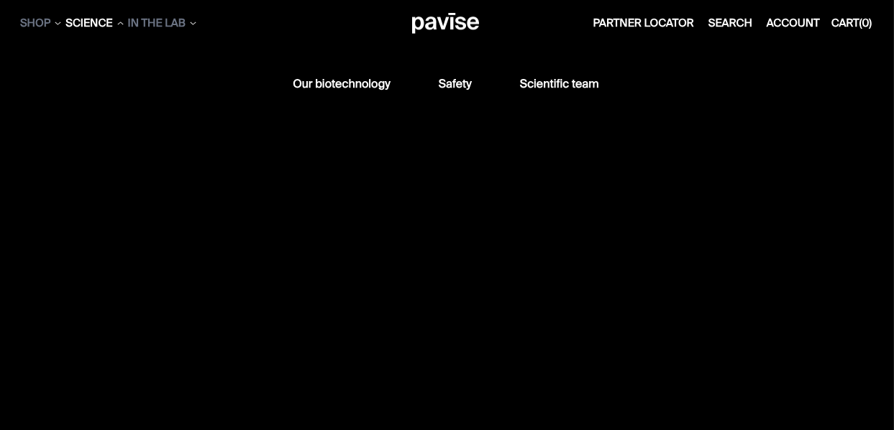
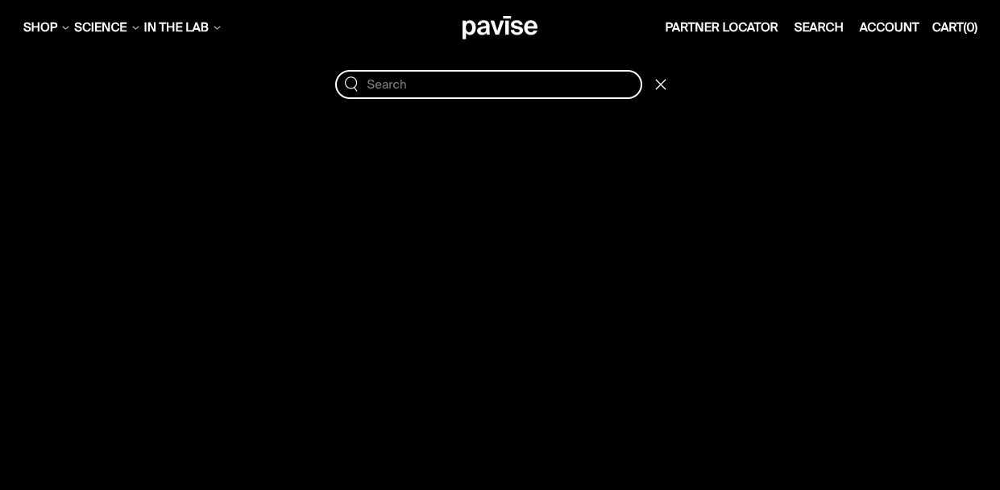
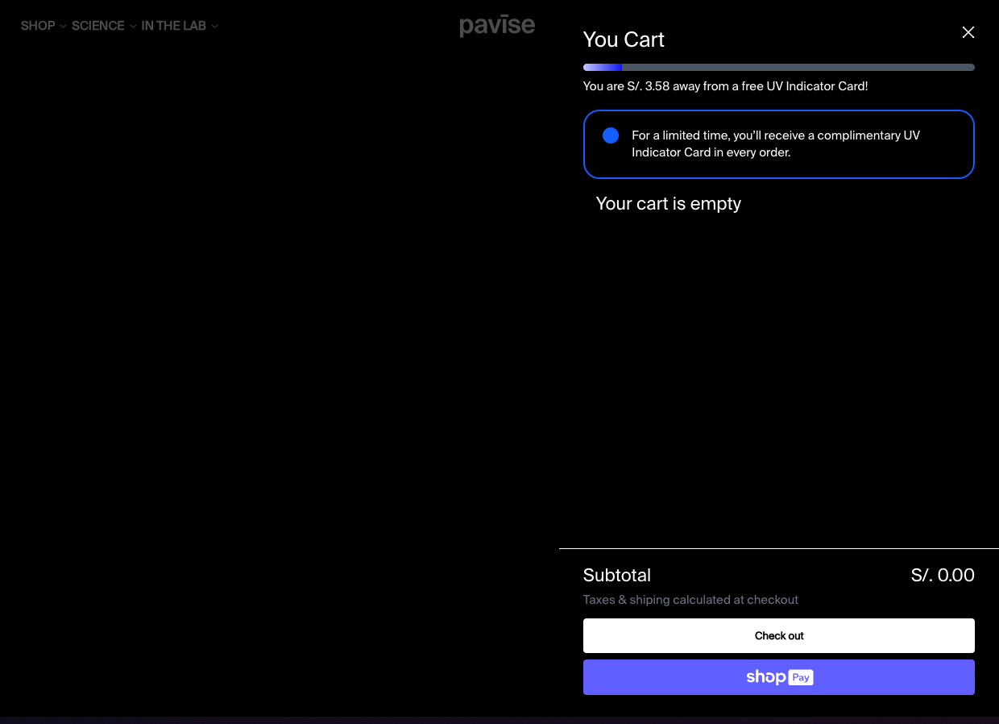

<p align="center">

</p>

## Project setup

```bash
$ pnpm install
```

## Compile and run the project

```bash
# development
$ pnpm run dev

# build project mode
$ pnpm run build

# preview mode
$ pnpm run preview

# format code mode
$ pnpm run lint
```

## Screenshots






